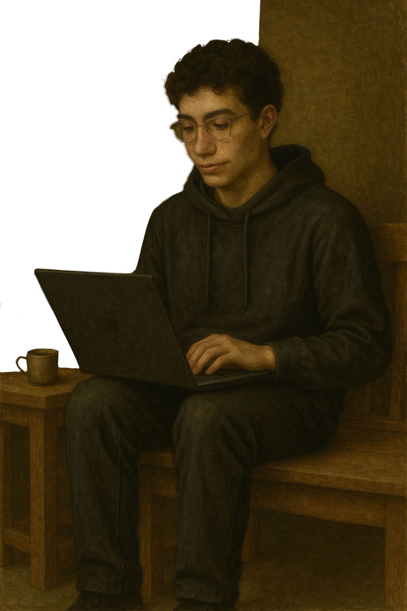

  

## 📜 About Me

Sou Gustavo, estudante de Sistemas de Informação na UFRN CERES. Gosto de explorar linguagens de programação, desenvolvimento de software. Sempre busco melhorar minhas habilidades, combinando lógica e criatividade para resolver problemas e criar soluções eficientes. Além disso, tenho interesse em artes, idiomas e desenvolvimento pessoal.

**Principais interesses:**

- 📡 Sistemas de Informação – Base teórica e prática para entender e construir soluções tecnológicas.

- 💻 Desenvolvimento de Software – Interesse em criar sistemas funcionais e bem estruturados.

- 🌍 Idiomas – Aprendizado contínuo de novas línguas e comunicação intercultural.

- 🎨 Artes – Interesse por desenho e criatividade no geral.

- 📈 Desenvolvimento Pessoal – Evoluir constantemente em diferentes áreas da vida.

  

---

## 📊 GitHub Chronicles

 

ㅤㅤ
  
  ㅤ
  

---

  

**Gustavo Douglas Silva Cruz**

  

